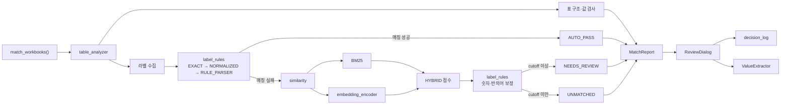

# jogyeon_matcher — 조견표 매칭 및 검증 엔진

## 1. 개요

`jogyeon_matcher`는 **작년 조견표와 올해 조견표를 비교해 라벨 변경, 표 구조 변화, 값 이상을 탐지하고 검토가 필요한 항목을 정리하는 모듈**이다.

외부 진입점은 `match_workbooks()` 하나다.

```python
from jogyeon_matcher import match_workbooks

report = match_workbooks(
    "조견표_2026.xlsx",
    "조견표_2027.xlsx",
)
```

입력은 비교할 두 조견표이고, 출력은 `MatchReport`다.

`MatchReport`에는 다음 결과가 함께 들어간다.

- 라벨별 매칭 결과
- 자동 통과 / 검토 필요 / 미매칭 상태
- 후보 3개와 BM25·임베딩·최종 점수
- 표 구조 이상
- 값 이상
- 단가표 생성에 필요한 필수 문구 누락 여부
- 전체 결과 요약

---

## 2. 전체 흐름



코드 흐름은 `engine.py`에서 시작한다.

```text
engine.py
│
├─ table_analyzer.py
│   ├─ 조견표 적재
│   ├─ 표 영역 탐지
│   ├─ 구조 비교
│   └─ 값 이상 검사
│
├─ label_rules.py
│   ├─ 문자열 정규화
│   ├─ 구조 라벨 파싱
│   ├─ 절대식 매칭
│   └─ 후보 점수 보정
│
├─ similarity.py
│   ├─ BM25
│   └─ BM25 + 임베딩 HYBRID 점수
│
├─ embedding_encoder.py
│   └─ ONNX 임베딩 생성
│
└─ MatchReport 조립
    └─ ReviewDialog → decision_log / 값 추출
```

---

## 3. 파일 구조

```text
app/
├── jogyeon_matcher/
│   ├── __init__.py
│   ├── engine.py
│   ├── table_analyzer.py
│   ├── label_rules.py
│   ├── similarity.py
│   ├── embedding_encoder.py
│   ├── decision_log.py
│   ├── paths.py
│   └── resources/
│       └── model/
│
├── config/
│   └── anchors.py
│
├── models/
│   └── dto.py
│
└── utils/
    └── xlsx_scan.py
```

### 파일별 역할

| 파일 | 핵심 역할 |
|---|---|
| `engine.py` | 조견 매처 전체 흐름 조립 및 `MatchReport` 생성 |
| `table_analyzer.py` | 엑셀 적재, 표 분리, 구조 및 값 이상 검사 |
| `label_rules.py` | 정규화, 구조 파싱, 절대식 매칭, 후보 제약 |
| `similarity.py` | BM25와 임베딩을 결합한 HYBRID 유사도 계산 |
| `embedding_encoder.py` | ONNX 모델을 이용한 384차원 임베딩 생성 |
| `decision_log.py` | 담당자가 확정한 검토 결과 기록 |
| `paths.py` | 모델 및 사용자 데이터 경로 해석 |
| `config/anchors.py` | 필수 라벨, 앵커, 반의어 규칙 |
| `models/dto.py` | `MatchReport`, `MatchItem`, `Candidate` 등 데이터 구조 |
| `utils/xlsx_scan.py` | XLSX의 실제 데이터 마지막 행 탐지 |

---

## 4. engine.py — 전체 기능 조립

`engine.py`는 조견 매처의 중심이다.

### `match_workbooks()`

전체 처리 순서를 조립한다.

```text
1. 두 조견표 적재
2. 시트별 TableRegion 생성
3. 표 구조 및 값 이상 검사
4. 문자열 라벨 수집
5. 시트별 절대식 매칭
6. 실패한 라벨만 HYBRID 매칭
7. 필수 문구 누락 검사
8. 전체 결과 요약
9. MatchReport 반환
```

### 주요 함수

| 함수 | 기능 |
|---|---|
| `match_workbooks()` | 전체 파이프라인 실행 |
| `_resolve_sheet()` | 시트 완전일치 또는 키워드 포함으로 대응 시트 탐색 |
| `_collect_labels()` | 표에서 문자열 라벨을 수집해 `LabelRef` 생성 |
| `_match_sheet()` | 한 시트의 전체 라벨 매칭 |
| `_match_one()` | 라벨 하나를 절대식 → HYBRID 순으로 판정 |
| `_rank_candidates()` | HYBRID 후보 3개 생성 |
| `_find_missing()` | 단가표 생성에 필요한 필수 문구 존재 여부 검사 |
| `_suggest()` | 누락된 필수 문구의 대체 후보 제시 |
| `_summarize()` | 전체 상태 집계 |

---

## 5. table_analyzer.py — 조견표 구조와 값 검사

### 엑셀 적재

`load()`는 `utils.xlsx_scan.true_row_counts()`로 실제 데이터 마지막 행을 먼저 확인한 뒤 필요한 범위까지만 읽는다.

읽은 문자열은 `sanitize()`로 정제하고 변경된 셀은 `Workbook.audit`에 기록한다.

### 표 탐지

`find_tables()`는 빈 행과 빈 열을 기준으로 데이터 영역을 나누고 각 영역을 `TableRegion`으로 만든다.

### 구조 검사

`fingerprint()`는 각 표를 다음 정보로 요약한다.

```text
표 크기
헤더 순서
열별 데이터 종류
```

`compare_sheets()`와 `check_anchor_uniqueness()`는 이를 이용해 다음 변화를 찾는다.

```text
SHEET_MISSING
SHEET_ADDED
SHEET_REMOVED
TABLE_COUNT_CHANGED
TABLE_SHAPE_CHANGED
HEADER_ORDER_CHANGED
ANCHOR_NOT_UNIQUE
```

### 값 검사

`compare_regions()`는 숫자 열의 변화도 비교한다.

```text
MONOTONICITY_BROKEN
    작년의 단조 증가/감소 방향이 올해 깨짐

UNIT_SHIFT_SUSPECTED
    올해 중앙값이 작년보다 10배 이상 크거나 작음
```

---

## 6. label_rules.py — 라벨 판정 규칙

`label_rules.py`는 모델을 사용하기 전 최대한 확정 가능한 항목을 먼저 처리한다.

### 정규화

```text
원문
 ↓ sanitize
NFKC 통일 + 비가시 문자 제거
 ↓ normalize
단위 괄호·장식 괄호·공백 제거
```

예:

```text
"기본 단가(원)"
→ "기본단가"
```

### 구조 파싱

`parse()`는 반복되는 라벨 구조를 객체로 변환한다.

```text
100%이하      → Band(100, "이하")
3등급         → Ordinal(3, ...)
3구간         → Ordinal(3, ...)
주간활동기본형 → Form(..., "기본형")
```

등급과 구간은 같은 순번이면 구조적으로 대응할 수 있도록 파싱하고, 실제 표기 종류가 달라진 경우 `engine.py`가 `ORDINAL_KIND_CHANGED`를 별도 기록한다.

### 절대식 매칭

`match_deterministic()`의 우선순위는 다음과 같다.

```text
EXACT
  원문이 동일
    ↓ 실패
NORMALIZED
  정규화 후 동일
    ↓ 실패
RULE_PARSER
  파싱 결과 동일
    ↓ 실패
HYBRID로 이동
```

세 절대식 경로는 `AUTO_PASS`가 가능하다.

### 숫자 및 반의어 제약

HYBRID 점수에는 `apply_vetoes()`가 적용된다.

숫자 관계:

```text
same      → 유지
extra     → × 0.6
conflict  → × 0.15
```

반의어 충돌:

```text
이하 ↔ 초과
이상 ↔ 미만
기본형 ↔ 확장형
가능 ↔ 불가능
...
```

충돌 시:

```text
score × 0.15
```

후보를 완전히 제거하지 않고 순위를 낮춰 사람이 확인할 수 있게 한다.

---

## 7. similarity.py + embedding_encoder.py — HYBRID 매칭

절대식 매칭에 실패한 라벨만 이 단계로 넘어온다.

### BM25

문자열을 문자 2-gram으로 나누어 표기 유사도를 계산한다.

예:

```text
기본단가
→ 기본 / 본단 / 단가
```

현재 BM25 점수는 후보 풀의 최고값이 아니라 **쿼리 자기 자신의 BM25 점수**로 나누어 0~1 범위로 사용한다.

### 임베딩

`DenseEncoder`는 ONNX 모델로 384차원 임베딩을 만든다.

```text
text
 ↓ tokenizer
input_ids / attention_mask
 ↓ ONNX
384차원 벡터
```

모델은 `encode()`가 실제 호출될 때만 로드한다.

`HybridMatcher.precompute_queries()`는 절대식 매칭에 실패한 라벨을 한 번에 인코딩해 ONNX 호출 횟수를 줄인다.

---

## 8. HYBRID 점수와 하이퍼파라미터

### 최종 점수

BM25와 임베딩 점수는 다음 식으로 결합한다.

```text
S_hybrid = α × S_BM25 + (1 - α) × S_dense
```

현재:

```text
α = 0.6
```

즉,

```text
S_hybrid = 0.6 × S_BM25 + 0.4 × S_dense
```

### 임베딩 점수 재척도화

ONNX 임베딩의 코사인 유사도는 그대로 사용하지 않고 다음 식으로 0~1 범위로 재척도화한다.

```text
S_dense = clip(
    (cosine - cosine_floor) / (1 - cosine_floor),
    0,
    1
)
```

현재:

```text
cosine_floor = 0.76
```

따라서 코사인 값이 0.76 이하이면 dense 점수는 0이 된다.

### cutoff

후보 점수 보정까지 끝난 1순위 후보가:

```text
score >= 0.28
```

이면:

```text
NEEDS_REVIEW
```

그보다 낮으면:

```text
UNMATCHED
```

이다.

HYBRID 결과는 점수가 높더라도 자동 통과시키지 않는다.

### 후보 보정값

| 항목 | 값 |
|---|---:|
| `alpha` | `0.6` |
| `cosine_floor` | `0.76` |
| `cutoff` | `0.28` |
| `CONFLICT_PENALTY` | `0.15` |
| `EXTRA_PENALTY` | `0.6` |
| `LOW_MARGIN_THRESHOLD` | `0.05` |
| `TOP_K` | `3` |
| `UNIT_SHIFT_RATIO` | `10` |

---

## 9. 후보 판정 구조

라벨 하나의 최종 판정은 다음과 같다.

```text
절대식 매칭 성공
    ↓
AUTO_PASS

절대식 매칭 실패
    ↓
BM25 + 임베딩
    ↓
숫자·반의어 점수 보정
    ↓
Top-3 후보
    ↓
┌───────────────────┬────────────────────┐
│ 1순위 >= cutoff   │ 1순위 < cutoff     │
│ NEEDS_REVIEW      │ UNMATCHED          │
└───────────────────┴────────────────────┘
```

추가로 다음 상황을 플래그로 기록한다.

| 플래그 | 의미 |
|---|---|
| `LOW_MARGIN` | 1순위와 2순위 점수차가 0.05 미만 |
| `CONTESTED` | 여러 작년 라벨이 같은 올해 후보를 1순위로 선택 |
| `NUMERIC_VETO_APPLIED` | 숫자 충돌로 점수 강등 |
| `NUMERIC_EXTRA` | 한쪽에 숫자가 추가되어 약하게 강등 |
| `ANTONYM_BLOCKED` | 반의어 충돌로 점수 강등 |
| `NEW_IN_TARGET` | 작년에 없던 올해 라벨 |

---

## 10. 필수 문구 검사

라벨 매칭과 별도로 `engine._find_missing()`은 `config/anchors.py`의 `REQUIRED`를 확인한다.

이 검사는 단순히 두 조견표의 라벨이 비슷한지를 보는 것이 아니라:

> **올해 조견표에서 실제 단가표 생성에 필요한 값을 읽을 수 있는가**

를 확인한다.

필수 문구를 찾지 못하면 `MissingValue`를 만들고, 가능한 경우 HYBRID 후보 3개와 작년 위치를 함께 제공한다.

앵커가 서로 다른 여러 행에 존재해 값 위치를 하나로 정할 수 없는 경우도 누락과 같은 방식으로 처리한다.

---

## 11. 최종 출력 — MatchReport

`match_workbooks()`는 모든 결과를 하나의 `MatchReport`로 조립한다.

```python
report.summary
report.items
report.review_items
report.missing_values
report.structural_alerts
report.value_anomalies
report.blocked
```

### 라벨 상태

| 상태 | 의미 |
|---|---|
| `AUTO_PASS` | 절대식 매칭으로 자동 확정 |
| `NEEDS_REVIEW` | HYBRID 후보가 존재하며 담당자 확인 필요 |
| `UNMATCHED` | 적절한 후보를 찾지 못함 |

### 후보 점수

각 `Candidate`에는 다음 값이 따로 저장된다.

```text
final
bm25
embedding
margin_to_next
flags
```

따라서 UI에서는 후보 순위뿐 아니라 **왜 해당 후보가 올라왔는지**도 확인할 수 있다.

---

## 12. 담당자 검토와 로그

`MatchReport`에 검토 대상이 있으면 `ReviewDialog`로 전달한다.

```text
MatchReport
   ↓
ReviewDialog
   ├─ 후보 선택
   └─ 직접 입력
        ↓
Decision
        ↓
decision_log.record()
```

`decision_log.py`는 담당자가 확정한 결과를 JSONL로 기록한다.

이 기록은 모델 학습용이 아니라 **어떤 항목을 어떤 판단으로 확정했는지 추적하기 위한 기록**이다.

검토가 완료되면 이후 `ValueExtractor`가 실제 조견표 값을 읽는 단계로 진행한다.

---

## 13. 코드 읽는 순서

전체 구조를 이해하려면 다음 순서로 읽는다.

```text
engine.py
   ↓
table_analyzer.py
   ↓
label_rules.py
   ↓
similarity.py
   ↓
embedding_encoder.py
   ↓
models/dto.py
```

먼저 `engine.py`에서 전체 호출 흐름을 본 뒤, 각 단계의 구현을 내려가면서 확인하는 방식이 가장 빠르다.

---

## 14. 검증

관련 테스트:

```powershell
python tests/test_matching_rules.py
python tests/test_label_matching.py
python tests/test_injection_e2e.py
```

앱 전체 실행 확인:

```powershell
python -m compileall app
python app/main.py
```

성능 확인:

```powershell
python tools/benchmark_perf.py --only match
```
