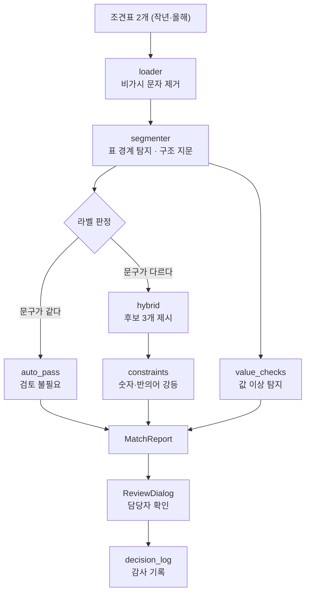
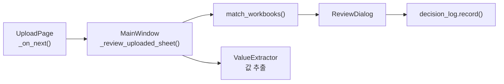

# jogyeon_matcher — 조견표 라벨 매칭 엔진

## 이 패키지가 푸는 문제

값 추출기는 `"기본단가"`, `"활동지원등급"` 같은 **문구로 셀을 찾습니다.**

```python
r, c = self._find_one(norm, BASE_PRICE)   # "기본단가" 가 있는 칸을 찾고
base_price = self._num(df.iat[r, c + 1])  # 그 오른쪽 칸에서 값을 읽는다
```

그런데 복지부가 내년 조견표에서 `"기본단가"` 를 `"기본 단가(원)"` 으로 바꾸면 이 코드가 깨집니다. 깨지면 그나마 다행이고, **진짜 위험은 조용히 엉뚱한 값을 읽는 것**입니다. `"상한액"` 을 포함한 셀이 두 개가 되면 추출기는 아무 말 없이 첫 번째를 집습니다.

이 패키지는 **작년 조견표와 올해 조견표를 대조해서, 문구가 바뀐 항목을 담당자에게 보여줍니다.** 값을 읽기 전에 사람이 확인하게 만드는 것이 목적입니다.

---

## 가장 짧은 사용법

```python
from jogyeon_matcher import match_workbooks

report = match_workbooks("조견표_2026.xlsx", "조견표_2027.xlsx")

print(report.summary.needs_review)   # 확인이 필요한 항목 수
for item in report.review_items:     # 자동 확정되지 않은 것만
    print(item.input_label.raw, [c.base_label for c in item.candidates])
```

`match_workbooks()` 가 전부입니다. 나머지는 모두 그 안에서 일어납니다.

---

## 전체 흐름



핵심은 **오른쪽 두 갈래가 서로 다른 것을 본다**는 점입니다. 라벨 판정은 문구를 보고, 값 검증은 숫자를 봅니다. 라벨이 완벽히 일치하는데 의미만 바뀐 경우(열 순서 교체 등)는 문구로는 원리적으로 볼 수 없기 때문에, 다른 축의 검증이 따로 필요합니다.

---

## 폴더 구조

```
jogyeon_matcher/
├── engine.py              전체 조립 — 여기부터 읽으면 됩니다
├── paths.py               번들(읽기전용) / APPDATA(쓰기가능) 경로 분리
│
├── ingest/                엑셀 → 구조화된 표
│   ├── loader.py            NFKC 정규화 + 비가시 문자 제거 + 감사 로그
│   └── segmenter.py         표 경계 탐지, 구조 지문, 앵커 유일성 검사
│
├── matching/              라벨 대조
│   ├── normalizer.py        비교용 정규형 (표현 분산만 제거)
│   ├── rule_parser.py       구간·등급·유형을 구조로 파싱해 동등성 비교
│   ├── sparse.py            BM25 (문자 2-gram) — 외부 의존성 없음
│   ├── dense.py             ONNX 임베딩 인코더 (지연 로딩)
│   ├── hybrid.py            두 점수 결합 + 컷오프
│   └── constraints.py       숫자·반의어 강등, 경합·마진 탐지
│
├── validation/
│   └── value_checks.py    라벨이 볼 수 없는 것을 값으로 잡는다
│
├── config/
│   ├── anchors.py         조견표 문구 상수 (값 추출기와 공유)
│   └── antonyms.py        필수-구분 사전
│
├── contracts/
│   └── schemas.py         MatchReport 등 UI 와의 계약
│
├── audit/
│   └── decision_log.py    담당자 선택 기록 (학습용 아님, 감사용)
│
└── resources/model/       ONNX int8 임베딩 모델 (62MB)
```

---

## 판정은 4단계, 신뢰 순서대로

`engine._match_deterministic()` 과 `engine._rank_candidates()` 가 이 순서를 구현합니다.

| 순서 | 경로 | 판정 방식 | auto_pass 가능? |
|---|---|---|---|
| 1 | `EXACT` | 원문이 글자까지 같다 | ✅ |
| 2 | `NORMALIZED` | 정규화 후 같다 (`기본 단가(원)` = `기본단가`) | ✅ |
| 3 | `RULE_PARSER` | 구조로 파싱해 동등 (`100 % 이하` = `100%이하`) | ✅ |
| 4 | `HYBRID` | 유사도가 높다 | ❌ **사람이 확인** |

**4번은 아무리 점수가 높아도 자동 통과시키지 않습니다.** 이게 이 설계의 핵심 규칙입니다.

이유는 간단합니다. `자기부담금 ↔ 본인부담금` 은 매칭해야 하고 `90% 이하 ↔ 90% 초과` 는 절대 안 되는데, 임베딩은 둘 다 0.9 이상을 줍니다. **어떤 임계값으로도 이 둘을 가를 수 없습니다.** 점수는 연속적인데 실패는 이산적이기 때문입니다.

반면 1~3번은 참/거짓이 명확합니다. 그래서 자동 통과의 근거가 될 수 있습니다.

### 규칙 파서가 하는 일

`rule_parser.py` 는 라벨을 구조로 바꿔서 **유사도 문제를 동등성 문제로 만듭니다.**

```
"100 % 이하"  →  Band(value=100.0, direction="이하")
"100%이하"    →  Band(value=100.0, direction="이하")   →  동등 ✅

"150% 초과"   →  Band(value=150.0, direction="초과")
"150% 이하"   →  Band(value=150.0, direction="이하")   →  불일치 ❌
```

퍼지 매칭 자체가 사라집니다. 소득밴드·등급·구간 계열이 여기서 결정론적으로 끝납니다.

`equals()` 의 반환값이 3가지인 점이 중요합니다.

| 반환 | 뜻 | 이후 |
|---|---|---|
| `True` | 파싱 성공 + 동일 | `auto_pass` |
| `False` | 파싱 성공 + 상이 | **점수와 무관하게 매칭 금지** |
| `None` | 파싱 불가 | 하이브리드로 폴백 |

---

## 점수는 어떻게 나오나

4번 경로로 넘어온 라벨만 점수를 계산합니다.

```
final = α × BM25 + (1 − α) × 재척도화된_코사인
        α = 0.6
```

**두 채널이 서로 다른 실패를 메웁니다.**

| 채널 | 강한 곳 | 약한 곳 |
|---|---|---|
| BM25 (문자 2-gram) | 오타, 어순, 축약 (`차상위`↔`차상휘`) | 글자가 안 겹치는 동의어 |
| 임베딩 | 의미가 같은 다른 단어 (`급여량`↔`지원량`) | 절대 척도가 없음 |

### 코사인 재척도화가 필요한 이유

e5 모델의 코사인은 **바닥이 0.76** 입니다. 아무 상관 없는 `김치찌개` 와 `50% 이하` 도 0.83이 나옵니다. 그대로 쓰면 "얼마나 확신하는가"의 척도로 쓸 수 없습니다.

```python
dense = clip((cos - 0.76) / (1 - 0.76), 0, 1)   # hybrid.py
```

바닥을 걷어내면 두 채널이 같은 0~1 척도가 됩니다. 실측으로 **α 유효 범위가 0.8 한 점에서 0.4~0.9 구간으로 넓어졌습니다.** 기본값 0.6은 그 중앙입니다.

> `COSINE_FLOOR = 0.76` 은 **이 모델 고유값**입니다. 모델을 바꾸면 반드시 다시 측정해야 합니다.

### 컷오프

```
음성대조군(진짜 무관) 최대   0.235
                              ← 간극
양성(정답 존재) 최소          0.323
컷오프                        0.280   ← 간극 중앙
```

컷오프 미만이면 `unmatched` 가 되어 **담당자 직접 입력**을 유도합니다. 틀린 답을 자신 있게 내미는 것보다 "모르겠습니다"가 안전하기 때문입니다.

---

## 제약 층 — 점수 밖에서 판정하는 것들

`constraints.py` 는 점수와 **별개로** 동작합니다. 유사도가 아무리 높아도 여기서 걸리면 강등됩니다.

### 숫자 관계 (3분류)

숫자는 장식이 아니라 판별자입니다. 다만 모든 불일치가 같은 무게는 아닙니다.

| 관계 | 예 | 계수 | 왜 |
|---|---|---|---|
| `same` | `1등급취약가구` ↔ `1등급취약계층` | 1.0 | 동의어 후보로 살려둠 |
| `extra` | `A값` ↔ `2027 A값` | 0.6 | 연도가 덧붙었을 뿐, 충돌 아님 |
| `conflict` | `10구간` ↔ `11구간` | 0.15 | 완전히 다른 행, 다른 금액 |

**차단이 아니라 강등입니다.** 완전히 막으면 복지부가 기준을 `85% 이하` → `90% 이하` 로 바꿨을 때 정답이 후보에서 사라집니다. 가장 중요한 변경에서 실패하게 되므로, 순위를 낮추되 사람이 볼 수는 있게 둡니다.

### 반의어

`config/antonyms.py` 의 쌍 중 한쪽씩만 포함하면 강등합니다. `이하/초과`, `이상/미만`, `기본형/확장형`, `가능/불가능` 등.

### 경합 탐지

두 개 이상의 작년 라벨이 **같은 올해 라벨을 1순위로 지목**하면 `CONTESTED` 를 붙입니다.

> 헝가리안 알고리즘(scipy)을 쓰지 않는 이유: 모든 1순위가 서로 다르면 그 배정은 각 행의 최댓값을 동시에 취한 것이라 **그리디가 곧 최적해**입니다. 즉 최적 배정과 그리디가 갈리려면 반드시 1순위가 겹쳐야 합니다. 1순위 공유만 확인하면 같은 항목을 잡아내므로, 90MB짜리 의존성이 필요 없습니다.

---

## 라벨이 볼 수 없는 것

`validation/value_checks.py` 는 **문구가 완벽히 일치하는데도 틀린 경우**를 잡습니다.

```
작년: [구간] [주간활동 기본형] [주간활동 확장형]
올해: [구간] [주간활동 확장형] [주간활동 기본형]   ← 열이 뒤바뀜
```

라벨 텍스트는 100% 일치합니다. 라벨 매칭은 이 실패를 **구조적으로** 볼 수 없습니다. 그래서 두 가지를 따로 봅니다.

**① 구조 지문** (`segmenter.fingerprint`) — 헤더의 *순서열*을 비교해 `HEADER_ORDER_CHANGED` 를 발생시킵니다.

**② 값 대조** (`value_checks.compare_regions`) — 규칙을 하드코딩하지 않고 **작년 표에서 불변식을 유도합니다.**

- 작년 열이 계속 감소했는데 올해는 아니다 → `MONOTONICITY_BROKEN`
- 올해 값이 작년의 10배를 넘는다 → `UNIT_SHIFT_SUSPECTED` (시간 → 분 같은 단위 변경)

항목이 늘어도 규칙을 새로 적을 필요가 없다는 점이 중요합니다.

---

## 결과 읽는 법

```python
report.summary            # 전체 / auto_pass / needs_review / unmatched / contested 집계
report.review_items       # 확인이 필요한 것만 (auto_pass 제외)
report.structural_alerts  # 표 구조 이상
report.value_anomalies    # 값 이상
report.blocked            # True 면 값 추출로 진행하면 안 됨
```

각 항목은 이렇게 생겼습니다.

```python
item.input_label.raw              # 작년 문구
item.status                       # auto_pass | needs_review | unmatched
item.match_path                   # exact | normalized | rule_parser | hybrid
item.candidates[0].base_label     # 올해 후보 1순위
item.candidates[0].bm25           # 점수 분해 — 담당자에게 보여줄 근거
item.candidates[0].embedding
item.flags                        # LOW_MARGIN, CONTESTED, ...
```

**점수 분해를 항상 실어 보내는 것은 장식이 아니라 요구사항입니다.** 담당자가 top-3에서 고르려면 "왜 이게 1순위인지"가 화면에 있어야 합니다.

### 코드 일람

| 구조 경보 | 뜻 | 치명적 |
|---|---|---|
| `SHEET_MISSING` | 작년에 있던 시트가 없음 | ✅ |
| `SHEET_ADDED` | 새 시트 | |
| `TABLE_COUNT_CHANGED` | 시트 내 표 개수가 다름 | ✅ |
| `TABLE_SHAPE_CHANGED` | 표 크기·헤더 구성 변경 | |
| `HEADER_ORDER_CHANGED` | 헤더 순서 교체 (열 뒤바뀜) | |
| `ANCHOR_NOT_UNIQUE` | 앵커를 포함한 셀이 2개 이상 | ✅ |
| `NORMALIZATION_COLLISION` | 다른 라벨이 정규화 후 같아짐 | |

| 값 이상 | 뜻 |
|---|---|
| `MONOTONICITY_BROKEN` | 작년엔 단조였는데 올해는 아님 |
| `UNIT_SHIFT_SUSPECTED` | 값 크기가 10배 이상 달라짐 |

| 플래그 | 뜻 |
|---|---|
| `LOW_MARGIN` | 1·2순위 점수차가 작음 |
| `CONTESTED` | 다른 라벨과 후보가 겹침 |
| `NUMERIC_VETO_APPLIED` | 숫자가 충돌해 강등됨 |
| `NUMERIC_EXTRA` | 한쪽에 숫자가 덧붙어 약하게 강등됨 |
| `ANTONYM_BLOCKED` | 반의어 충돌로 강등됨 |
| `NEW_IN_TARGET` | 작년에 없던 올해 라벨 |

---

## 앱과 어떻게 연결되어 있나



**값을 읽기 전에 대조합니다.** 서식이 바뀐 걸 모른 채 값을 읽으면 조용히 틀린 값이 나오기 때문입니다. 담당자가 검토 화면에서 취소하면 값 추출로 넘어가지 않습니다.

작년 조견표 경로는 `services/recent_files.py` 가 `%APPDATA%` 에 기억합니다. 기록이 없으면 한 번 물어보고, 사양하면 대조를 건너뜁니다.

### 바깥과 주고받는 것

```
services/jogyeon_value_extractor.py  ──imports──>  config/anchors.py
                                                    (조견표 문구 정의)

paths.py  ──imports──>  utils/appdata.py
                        (%APPDATA% 경로)

ui/dialogs/review_dialog.py  ──imports──>  contracts/schemas.py
ui/main_window.py            ──imports──>  match_workbooks, decision_log
```

**`config/anchors.py` 는 값 추출기와 공유합니다.** 조견표 문구를 양쪽에 따로 두면, 한쪽만 고쳤을 때 매처는 옛 라벨을 감시하고 추출기는 새 라벨을 읽는 상태가 됩니다. 가장 알아채기 어려운 형태로 어긋나므로 정의를 한 곳에만 둡니다.

---

## 임베딩 모델

`resources/model/` 에 ONNX int8 모델이 들어 있습니다. **런타임 의존성은 `onnxruntime` 과 `tokenizers` 둘뿐**이고, torch·transformers 는 들어가지 않습니다.

| 파일 | 용량 |
|---|---|
| `model_int8.onnx` | 58.5MB |
| `tokenizer.json` | 3.6MB |
| `meta.json` | 출처·설정·검증 결과 |

원본(`intfloat/multilingual-e5-small`)에서 두 단계를 거쳤습니다.

1. **어휘 축소** 250,002 → 102,290 (한글·ASCII 라틴만) — 우리 라벨이 선택하지 않는 토큰이라 결과가 원본과 **비트 단위로 동일**합니다
2. **int8 양자화** 448MB → 58.5MB

### 지연 로딩

`dense.py` 는 **첫 `encode()` 호출 전까지 아무것도 로드하지 않습니다.**

서식이 바뀌지 않은 해에는 모든 라벨이 1~3번 경로에서 끝나므로 하이브리드에 도달하지 않습니다. 그런 해에는 **모델이 아예 메모리에 올라오지 않습니다.** 콜드 스타트 약 1.2초를 절약합니다.

모델을 다시 만들려면 `tools/export_model.py` 를 보세요. 평소에는 실행할 필요가 없습니다.

---

## 값을 바꿀 때 주의할 것

| 상수 | 위치 | 근거 | 바꾸면 |
|---|---|---|---|
| `alpha = 0.6` | `hybrid.py` | 실측 유효 범위 0.4~0.9의 중앙 | 재검증 필요 |
| `COSINE_FLOOR = 0.76` | `hybrid.py` | e5-small 실측 코사인 하한 | **모델 교체 시 반드시 재측정** |
| `cutoff = 0.28` | `hybrid.py` | 음성 0.235 / 양성 0.323 사이 중앙 | 실제 조견표 확보 시 재보정 권장 |
| `CONFLICT_PENALTY = 0.15` | `constraints.py` | 강등이지 차단이 아님 | 0으로 두면 정당한 개칭이 사라짐 |
| `ALLOWED_SCRIPTS` | `tools/prune_vocab.py` | 한글·라틴만 (T3) | 한자가 나오면 T2로 올릴 것 |

**정규화 규칙을 넓힐 때 특히 조심해야 합니다.** `normalizer.py` 는 표현 분산만 제거하고 판별 내용(숫자·`%`·`~`·방향어·유형어)은 보존합니다. 예를 들어 괄호를 전부 벗기면 `1등급(가형)` 이 `1등급` 이 되어 다른 항목과 충돌합니다. 그래서 괄호 안이 단위 토큰일 때만 제거합니다.

정규화가 판별 내용을 삼키면 `find_normalization_collisions()` 가 기동 시 잡아냅니다.

---

## 검증

두 가지 테스트가 있습니다. 엔진을 고쳤으면 둘 다 돌려야 합니다.

```powershell
python _experiments/exp09_injection_e2e.py    # 합성 조견표 주입 22건 E2E
python _experiments/exp07_rules_smoke.py      # 정규화·파서·제약 스모크
```

`exp09` 는 실제 파일 형태의 합성 조견표 한 쌍을 파이프라인 전체에 통과시키고, 주입 정답지 22건과 대조합니다. 표기 변형·비가시 문자·동의어·반의어·열 순서 교체·단위 이동 등이 모두 들어 있습니다.

> `_experiments/` 는 gitignore 되어 있습니다. 폴더를 지우실 예정이면 이 두 스크립트를 `tests/` 로 옮기고 위 경로도 함께 고쳐 주세요.
